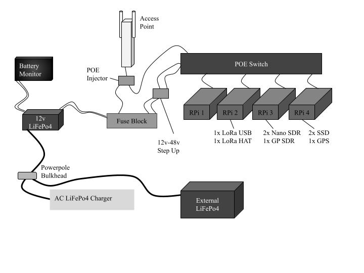

# Portable EmComm Cluster Server

[Overview](#Overview)
[Features](#Features)
[Harware](#Hardware)
[Software Stack](#Software)
[Installation](#Installation)
[Contributions](#Contributions)
[Planned Versions](#Planned_Versions)

## Overview

This repository contains all the configurations, scripts, and documentation needed to set up and maintain a portable Raspberry Pi cluster server. The cluster is designed to support emergency communications and networking, leveraging PXE booting, overlays, and various specialized tools.

The system integrates features like software-defined radios (SDRs), LoRa communication, Reticulum-based mesh networking, and more, enabling the cluster to behave like a cohesive, multifunctional unit for diverse tasks.

## Features

**PXE Boot Environment:** Centralized boot server using TFTP and NFS to manage operating systems across cluster nodes.

**Overlay Management:** Modular overlays for node-specific software and configurations, simplifying updates and customization.

**Emergency Communication Tools:** Support for ham radio software (FLdigi, Winlink), SDR applications (CubicSDR, SDR Trunk, Dump1090), and LoRa communication.

**Mesh Networking:** Reticulum-powered peer-to-peer networking with Mosquitto MQTT broker and FreeTAC Server integration.

**Time Synchronization:** GPS-based and NTP time sync for improved reliability in isolated networks.

## Hardware

- Raspberry Pi 5s (4 GB or 8 GB) with PoE hats.

- Peripheral equipment: USB SDRs, GPS receiver, SSD, LoRa hats/dongles.

- Managed PoE switch with VLAN and QoS capabilities.

- Battery power supply with AC passthrough charging.

## Software

**Base OS:** Raspberry Pi OS with a custom overlay for each node.

**PXE Boot:** *dnsmask (DHCP and TFTP configuration), OverlayFS, NFS.*

**RF Communication Tools:** *FLdigi, Winlink, JS8Call, Direwolf, CQRLog.*

**Mesh Networking:** *Reticulum, Mosquitto MQTT, FreeTAKServer.*

**Passive RF Monitoring:** *SDR Trunk, CubicSDR, Dump1090, Dump978, PyAware.*

**Security Tools** *UFW, Fail2Ban, Security Breach Monitoring Script.*

**Administrative Tools** *Rsync, SSH, Parallel, SSH, Flask Client Dashboard.*

**Other Services** *NTP via GPS, Offline HTML + CSS Learning Portal, Yacy, OLED Status Display Script, PyGame.*

## Installation

1. Clone this repository to the PXE boot node.

2. Follow the instructions in docs/setup.md for installing dependencies and configuring PXE boot.

3. Apply overlays for each node using the scripts provided in overlays/.

4. Test and verify functionality node by node.

## Contributions

This repository is tailored to a specific use case, but contributions are welcome if they align with the project's goals. Please open an issue or submit a pull request for discussion.

## Acknowledgments

Raspberry Pi Foundation for the hardware and OS.

Open-source tools and communities behind FLdigi, SDR Trunk, Reticulum, and other software.

ChatGPT for troubleshooting and brainstorming assistance.

## Planned_Versions

**Version 0.1:** Core setup and basic functionality.

        PXE boot environment operational.

        NFS, SSH, and VNC working across nodes.

        Basic overlays for node-specific configurations.

**Version 0.2:** Full overlay implementation and tool integration.

        Node-specific functionalities enabled (e.g., SDR tools, LoRa communication, Reticulum).

        GPS-based time synchronization introduced.

        Initial power management tools.

**Version 0.3:** Enhanced networking and monitoring.

        Mesh networking with Reticulum and MQTT broker fully implemented.

        HTTP dashboard for cluster status.

        LogWatch integration for automated reporting.

**Version 0.4:** Optimization and portability.

        Improved power management for extended battery use.

        Hardware monitoring tools for thermal and power usage.

        Finalized cluster casing and cable management.

**Version 1.0:** Stable release.

        Fully documented and tested cluster server.

        Streamlined deployment process for replication by other users.
